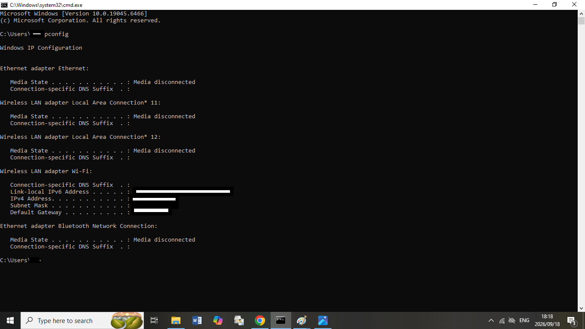
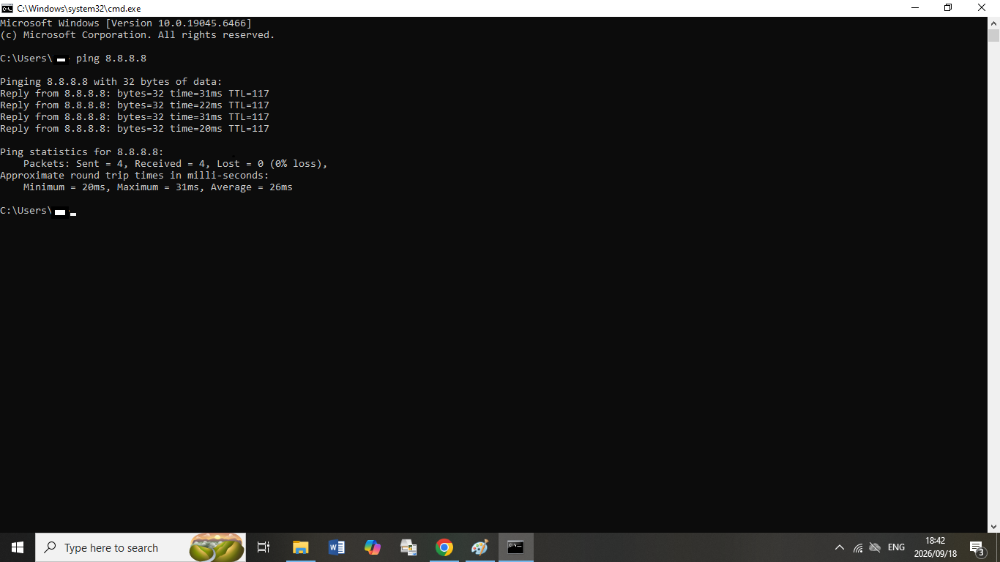
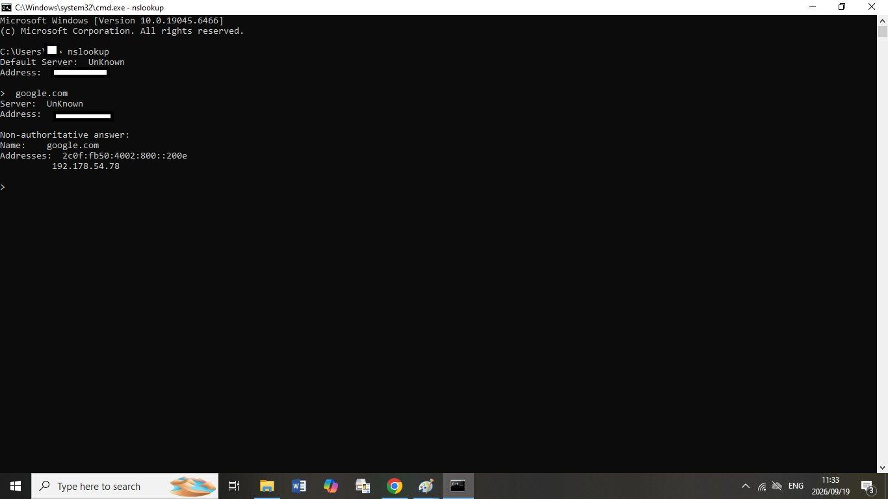
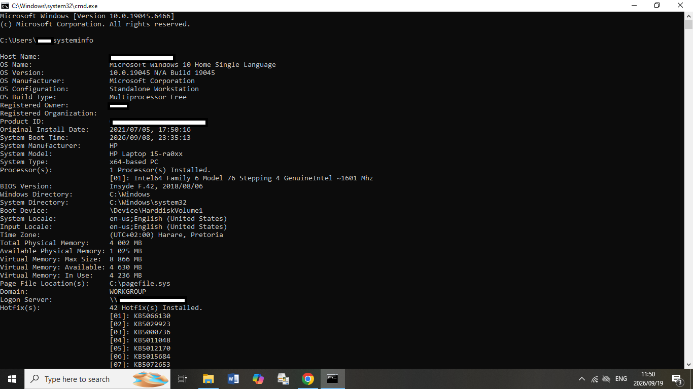

# Windows-IT-Support-Troubleshooting-Lab
A practical IT Support troubleshooting portfolio demonstrating Windows, networking, command-line tools, and help desk problem-solving skills.

## 📌 Project Overview

This project demonstrates practical IT Support and Help Desk troubleshooting skills using Windows-based scenarios.

The goal of this project is to document common technical problems, identify their possible causes, perform troubleshooting steps, and document the resolution.

This project was created as part of my ongoing development in IT Support, networking, and cybersecurity.

---

## 🎯 Skills Demonstrated

* Windows troubleshooting
* Basic network troubleshooting
* IP addressing
* DNS troubleshooting
* DHCP troubleshooting
* Command-line troubleshooting
* User account troubleshooting
* System information gathering
* Help desk documentation
* Problem-solving
* Technical communication

---

## 🛠️ Tools Used

* Windows 10/11
* Command Prompt
* PowerShell
* ipconfig
* ping
* tracert
* nslookup
* hostname
* systeminfo
* whoami

---

## 🔎 Troubleshooting Methodology

For each technical problem, I follow a structured troubleshooting process:

1. Identify the problem
2. Establish a theory of probable cause
3. Test the theory
4. Establish a plan of action
5. Implement the solution
6. Verify full system functionality
7. Document the findings

---

## 🧪 Troubleshooting Scenarios

### Scenario 1 — No Internet Connection

**Problem:**

A user reports that their computer cannot access the internet.

**Initial Investigation:**

I would first determine whether the problem affects only one computer or multiple devices.

**Troubleshooting Steps:**

1. Check the physical/Wi-Fi connection.
2. Run:

ipconfig

3. Check the assigned IP address.
4. Test the local network:

ping 192.168.1.1

5. Test internet connectivity:

ping 8.8.8.8

6. Test DNS resolution:

nslookup google.com

7. Renew the IP address if necessary:

ipconfig /release
ipconfig /renew

**Verification:**

Confirm that the user can access websites and that DNS resolution is functioning correctly.

---

### Scenario 2 — Slow Computer

**Problem:**

A user reports that their computer has become unusually slow.

**Troubleshooting Steps:**

1. Check CPU, memory, and disk usage.
2. Review running applications.
3. Check available disk space.
4. Review startup applications.
5. Check for Windows updates.
6. Perform a malware/security check.
7. Restart the computer if appropriate.
8. Verify system performance after troubleshooting.

---

### Scenario 3 — DNS Troubleshooting

**Problem:**

A user can access an IP address but cannot access websites using domain names.

**Troubleshooting Steps:**

Test connectivity using:

ping 8.8.8.8

Then test DNS resolution:

nslookup google.com

If the IP connectivity test succeeds but DNS resolution fails, DNS may be the source of the problem.

**Possible Actions:**

* Check DNS configuration.
* Verify the DNS server address.
* Flush the DNS cache:

ipconfig /flushdns

* Test DNS resolution again.

---

## 💻 Useful Windows Commands

| Command         | Purpose                                      |
| --------------- | -------------------------------------------- |
| ipconfig        | Displays IP configuration                    |
| ipconfig /all   | Displays detailed network configuration      |
| ping            | Tests network connectivity                   |
| tracert         | Shows the path packets take to a destination |
| nslookup        | Troubleshoots DNS resolution                 |
| hostname        | Displays the computer name                   |
| systeminfo      | Displays detailed Windows system information |
| whoami          | Displays the currently logged-in user        |

---

## 📚 What I Learned

Through this project I practiced approaching IT problems systematically rather than immediately applying random fixes.

I also developed a better understanding of:

* Windows troubleshooting
* TCP/IP fundamentals
* DNS
* DHCP
* Network connectivity testing
* Command-line tools
* Technical documentation

---
## 📸 Hands-On Evidence

### 1. IP Configuration — ipconfig

I Used the ipconfig command to view the workstation's network configuration, including the IPv4 address, subnet mask, and default gateway.

---

### 2. Network Connectivity — `ping`

I Used the ping command to test network connectivity to 8.8.8.8. The test returned 0% packet loss.

---

### 3. DNS Troubleshooting — nslookup

I Used nslookup to verify DNS name resolution for google.com.

---

### 4. Windows System Information — `systeminfo`

I Used the systeminfo command to gather Windows operating system, hardware, memory, and system configuration information.

---

## 🚀 Future Improvements

I plan to expand this portfolio with additional projects covering:

* Active Directory
* Windows Server
* Network troubleshooting
* PowerShell automation
* IT security
* User and group management
* Help desk ticket simulations

---

## 👤 About Me

I am developing my skills in IT Support, networking, and cybersecurity, with a focus on building practical hands-on experience through labs and troubleshooting projects.

My goal is to apply these skills in a professional IT Support environment while continuing to develop my technical knowledge.
